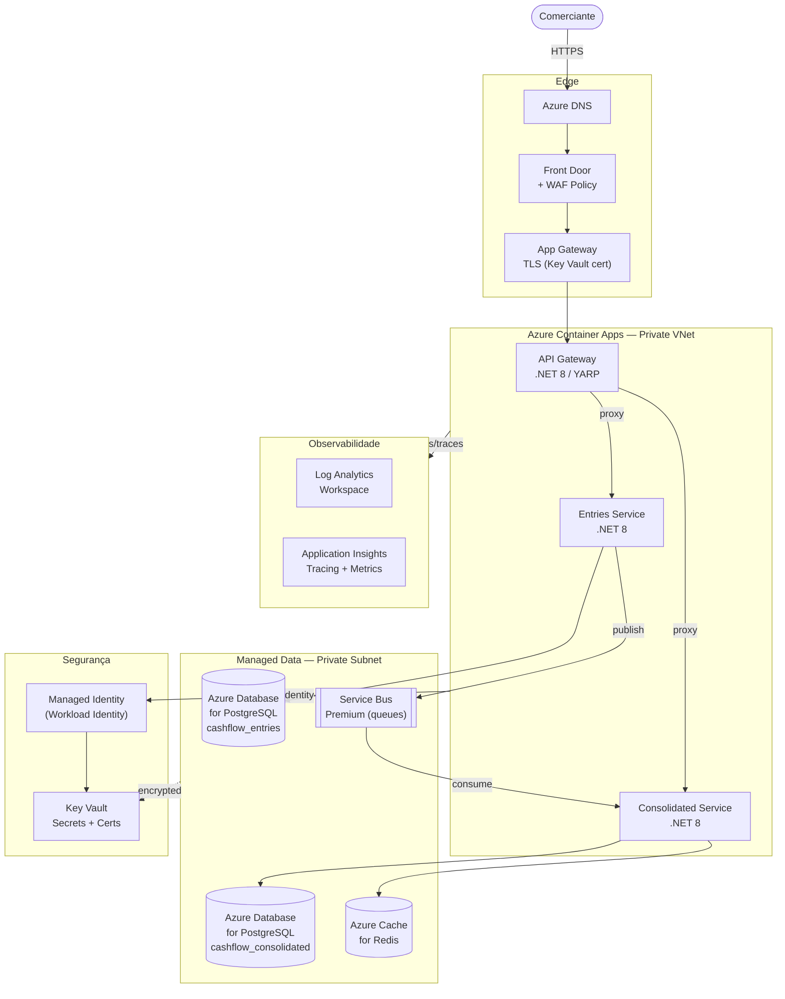
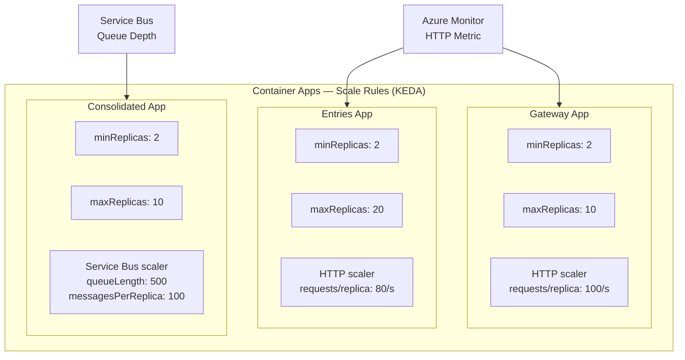
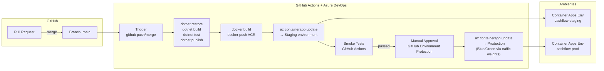
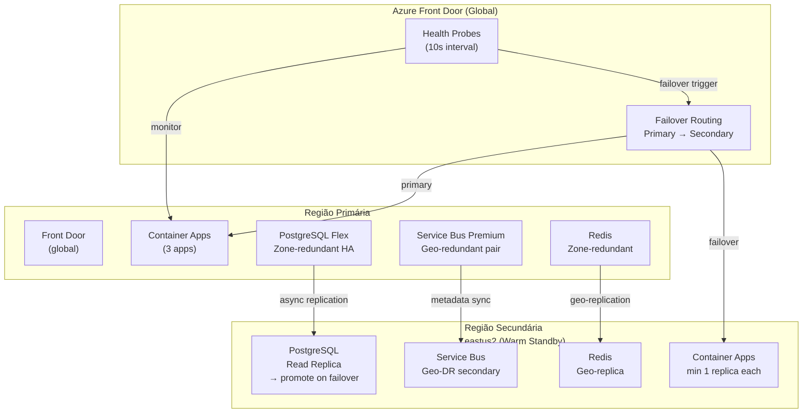
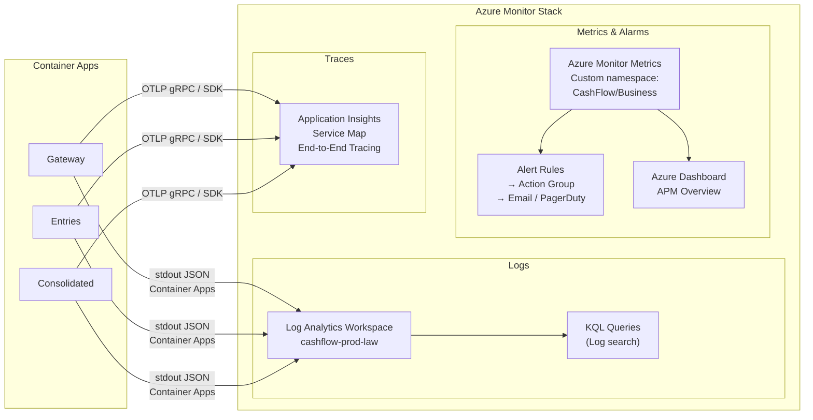

# Cloud Architecture — CashFlow System (Azure)

> Mapeamento da solução para infraestrutura Azure production-ready.  
> Referência: [C4 Container Diagram](container.md) · [Versão AWS](cloud.md)

---

## 1. Visão Geral da Infraestrutura Azure



---

## 2. Diagrama de Rede (NSG / Private Endpoints)

```mermaid
flowchart LR
    subgraph NSG_FE["NSG: frontend-nsg"]
        direction TB
        A1["Ingress: 443 TCP — Internet"]
        A2["Egress: 8080 TCP → app-nsg"]
    end

    subgraph NSG_APP["NSG: app-nsg"]
        direction TB
        B1["Ingress: 8080 TCP ← frontend-nsg"]
        B2["Egress: 5432 TCP → data-nsg  (PostgreSQL)"]
        B3["Egress: 5671 TCP → data-nsg  (Service Bus AMQP TLS)"]
        B4["Egress: 6380 TCP → data-nsg  (Redis TLS)"]
        B5["Egress: 443 TCP → Internet  (ACR, Key Vault, Monitor)"]
    end

    subgraph NSG_DATA["NSG: data-nsg  (Private Endpoints)"]
        direction TB
        C1["PostgreSQL Private Endpoint"]
        C2["Service Bus Private Endpoint"]
        C3["Redis Private Endpoint"]
    end

    NSG_FE -->|"traffic"| NSG_APP
    NSG_APP -->|"traffic"| NSG_DATA
```



---

## 3. Mapeamento: Local → Azure

| Componente Local (Docker Compose) | Serviço Azure | Justificativa |
|---|---|---|
| `cashflow-gateway` (container) | **Azure Container Apps** | Serverless containers com KEDA, sem AKS overhead |
| `cashflow-entries` (container) | **Azure Container Apps** | Escala horizontal independente via HTTP scaling |
| `cashflow-consolidated` (container) | **Azure Container Apps** | Scale-out por Service Bus queue depth (KEDA) |
| PostgreSQL (Docker) | **Azure Database for PostgreSQL Flexible Server** | HA com standby zone-redundant, PITR, backups gerenciados |
| RabbitMQ (Docker) | **Azure Service Bus Premium** | Filas duráveis, dead-letter nativo, geo-redundância |
| Redis (Docker) | **Azure Cache for Redis** (Standard) | Zone-redundant, persistence, TLS |
| Seq (Docker) | **Log Analytics Workspace + Application Insights** | Integrado ao Azure Monitor; KQL queries |
| Jaeger (Docker) | **Application Insights** | Distributed tracing nativo com Service Map |
| `.env` secrets | **Azure Key Vault** | Rotação automática, RBAC, acesso via Managed Identity |
| `appsettings.json` config | **App Configuration** | Feature flags, hierarchical keys, Key Vault references |
| Docker Hub images | **Azure Container Registry (ACR)** | Private registry, geo-replication, vulnerability scan |

---

## 4. Estratégia de Escalonamento (KEDA)



### SLA de Escalabilidade

| Métrica | Threshold | Ação |
|---|---|---|
| Entries HTTP requests/replica > 80/s | imediato | +1 replica |
| Consolidated Queue depth > 500 | imediato (KEDA) | +1 replica por 100 msgs |
| Gateway HTTP requests/replica > 100/s | imediato | +1 replica |
| Qualquer app sem tráfego | 5 minutos | Scale-in até minReplicas |

---

## 5. CI/CD Pipeline



### Blue/Green com Container Apps Traffic Weights

1. Nova revisão (Green) é criada com `--traffic-weight latest=10`
2. Azure Monitor observa error rate e latência p99 por 5 minutos
3. Se saudável: `--traffic-weight latest=100` — revisão anterior recebe 0%
4. Se alarm: `--traffic-weight latest=0` — rollback imediato sem redeploy

---

## 6. Estratégia de Disaster Recovery



| Tier | RTO | RPO | Estratégia |
|---|---|---|---|
| PostgreSQL (dados financeiros) | < 5 min | < 1 min | Zone-redundant HA sync + cross-region async replica |
| Container Apps | < 3 min | N/A (stateless) | Front Door failover redireciona para região secundária |
| Service Bus Premium | < 2 min | 0 (durable) | Geo-DR com failover manual ou automático |
| Azure Cache for Redis | < 1 min | < 30s | Geo-replicação + failover automático |
| Region failover total | < 15 min | < 5 min | Front Door failover + warm standby |

---

## 7. Observabilidade em Produção



### Alertas Críticos de Produção

| Alerta | Métrica | Threshold | Ação |
|---|---|---|---|
| `HighErrorRate` | App Insights — failed requests | > 5% por 3 min | Action Group → PagerDuty P1 |
| `HighLatency` | App Insights — server response p99 | > 2s por 5 min | Action Group → PagerDuty P2 |
| `QueueDepthHigh` | Service Bus — active messages | > 1000 msgs | Action Group → P2 + KEDA scale |
| `DBConnections` | PostgreSQL — active connections | > 80% max | Action Group → P2 |
| `CacheEvictions` | Redis — evicted keys | > 100/min | Action Group → Slack |
| `ReplicaRestart` | Container Apps — restart count | > 3 em 5 min | Action Group → P1 |
| `DLQNotEmpty` | Service Bus — dead-letter count | > 0 | Action Group → Slack + ticket |

---

## 8. Estimativa de Custo (Brazil South — 50 req/s pico)

| Serviço | Configuração | Custo/mês (estimado) |
|---|---|---|
| Container Apps — 3 apps | 2–6 replicas × 0.5 vCPU / 1GB | ~$55–$110 |
| Azure Database for PostgreSQL | Flexible Server D2s_v3 Zone-HA × 2 | ~$160 |
| Service Bus Premium | 1 Messaging Unit | ~$670* |
| Azure Cache for Redis | Standard C1 (1GB) | ~$55 |
| App Gateway + Front Door | Standard_v2 + Standard tier | ~$45 |
| Azure Container Registry | Basic tier | ~$5 |
| Log Analytics | ~10GB/mês ingestion | ~$25 |
| Application Insights | ~5GB/mês data | ~$8 |
| Key Vault | 5 secrets + operations | ~$2 |
| **Total estimado** | | **~$1.025–$1.080/mês** |

> ~ **Service Bus Premium** é o maior custo (MU dedicada). Para cargas menores, **Service Bus Standard** (~$10/mês) é suficiente, perdendo geo-DR e private endpoints.  
> Com Reserved Instances em PostgreSQL + Redis (1 ano): ~20% de desconto → **~$870–$930/mês** (Premium) ou **~$310–$360/mês** com Service Bus Standard.

---

## 9. Checklist de Produção

- [ ] `JWT_SECRET_KEY` ≥ 32 chars armazenada no **Key Vault** — Container Apps acessa via `secretref` com Managed Identity
- [ ] PostgreSQL Flexible Server: **encryption at rest** (CMK no Key Vault), backups automáticos 7 dias, PITR habilitado
- [ ] Redis: `requirepass` + **TLS in-transit** (porta 6380), acesso via Private Endpoint
- [ ] Front Door WAF: regras **OWASP 3.2 CRS** + rate limit por IP (1000 req/5min)
- [ ] App Gateway: TLS policy `AppGwSslPolicy20220101S` (TLS 1.2+ only)
- [ ] Container Apps: `readOnlyRootFileSystem: true`, non-root user (`uid 1001`)
- [ ] **Managed Identity** em todas as Container Apps (sem connection strings com senha em config)
- [ ] VNet Integration + Private Endpoints para todos os serviços de dados
- [ ] **Diagnostic Settings** habilitados em todos os recursos → Log Analytics Workspace
- [ ] Azure Defender for Containers habilitado
- [ ] Budget Alert configurado (> R$6.000/mês)
- [ ] Tags em todos os recursos: `Project=CashFlow`, `Env=prod`, `ManagedBy=terraform`

---

## 10. Evidência de RNF — Load Test em Azure

Duas opções para validar o RNF em Azure:

### Opção A: k6 local contra Front Door

```bash
# Configurar target Azure
export BASE_URL=https://cashflow-fd-<hash>.azurefd.net

# Smoke
k6 run -e BASE_URL=$BASE_URL -e SCENARIO=smoke tests/load/k6-scenarios.js

# Load (evidência RNF)
k6 run -e BASE_URL=$BASE_URL -e SCENARIO=load \
       --summary-export=tests/load/results/azure-load-$(date +%Y%m%d).json \
       tests/load/k6-scenarios.js
```

### Opção B: Azure Load Testing (nativo, integrado ao CI/CD)

```bash
az load test run \
  --resource-group rg-cashflow-prod \
  --name cashflow-load-test \
  --test-id rnf-50rps \
  --load-test-config-file tests/load/cloud/azure-load-test.yaml
```

### Thresholds esperados

| Threshold | Valor esperado em Azure (Container Apps + Front Door) |
|---|---|
| `http_req_failed < 0.05` | ~0.05% (Front Door health probes removem instâncias ruins) |
| `http_req_duration p(95) < 500ms` | ~110 ms (Front Door POP edge; Redis TLS ~1ms) |
| Throughput sustentado | ~85 req/s com min 2 réplicas por app |

Front Door caching beneficia especialmente o `/api/consolidated/{date}` para datas históricas (TTL 24h → hit rate >99%).

Relatório completo: [`docs/operations/rnf-throughput-evidence.md`](../operations/rnf-throughput-evidence.md)
