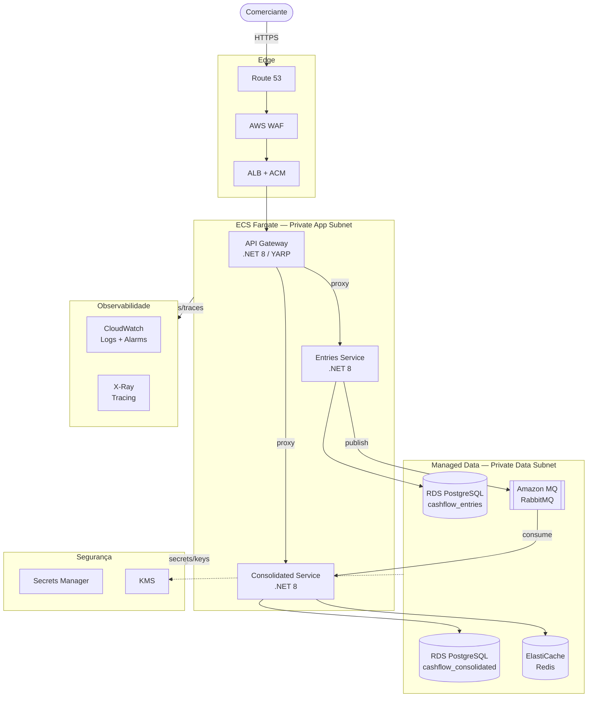
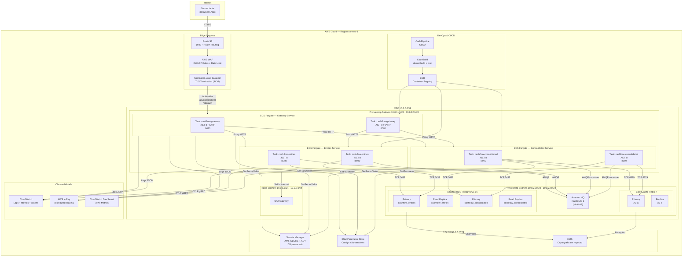
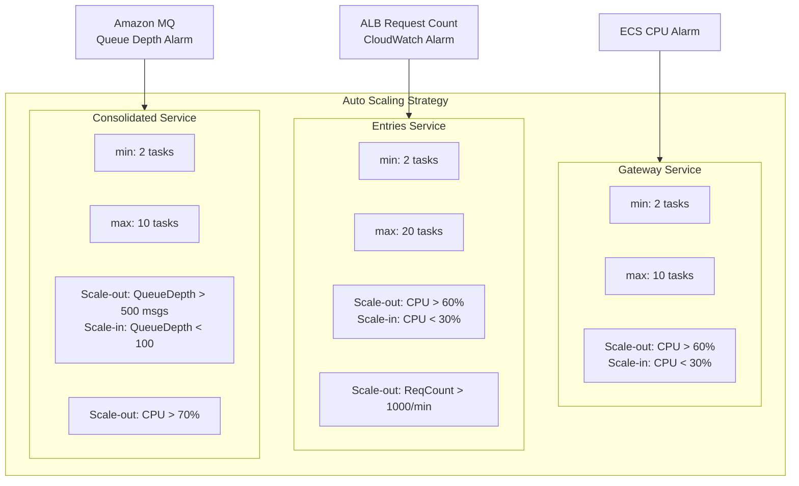
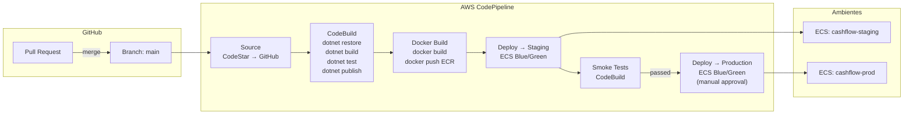
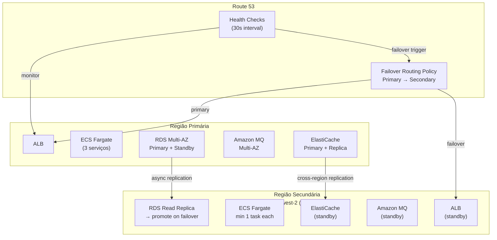
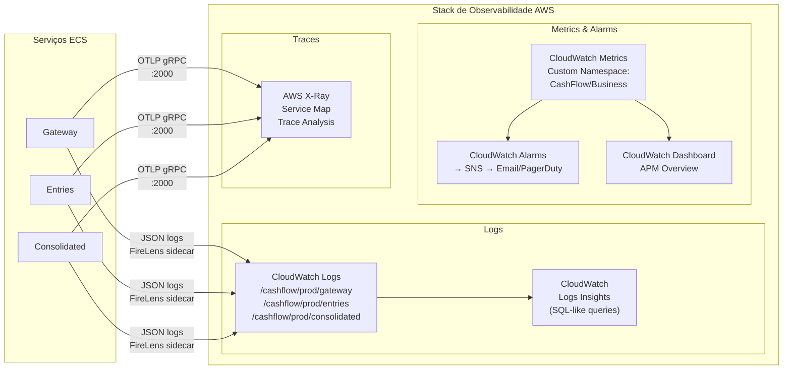

# Cloud Architecture — CashFlow System

> Mapeamento da solução para infraestrutura AWS production-ready.  
> Referência: [C4 Container Diagram](container.md) · [Versão Azure](cloud-azure.md)

---


## 1. Visão Geral da Infraestrutura AWS



---

## 1.1 Visão Geral da Infraestrutura AWS



---

## 2. Diagrama de Rede (Security Groups)

```mermaid
flowchart LR
    subgraph SG_ALB["SG: alb-sg"]
        direction TB
        A1["Ingress: 443 TCP — 0.0.0.0/0"]
        A2["Egress: 8080 TCP → app-sg"]
    end

    subgraph SG_APP["SG: app-sg"]
        direction TB
        B1["Ingress: 8080 TCP ← alb-sg"]
        B2["Egress: 5432 TCP → data-sg"]
        B3["Egress: 5671 TCP → data-sg  (AMQP TLS)"]
        B4["Egress: 6379 TCP → data-sg"]
        B5["Egress: 443 TCP → 0.0.0.0/0  (ECR, SM, SSM)"]
        B6["Egress: 2000 UDP → 0.0.0.0/0  (X-Ray daemon)"]
    end

    subgraph SG_DATA["SG: data-sg"]
        direction TB
        C1["Ingress: 5432 TCP ← app-sg"]
        C2["Ingress: 5671 TCP ← app-sg"]
        C3["Ingress: 6379 TCP ← app-sg"]
    end

    SG_ALB -->|"traffic"| SG_APP
    SG_APP -->|"traffic"| SG_DATA
```



---

## 3. Mapeamento: Local → AWS

| Componente Local (Docker Compose) | Serviço AWS | Justificativa |
|---|---|---|
| `cashflow-gateway` (ECS container) | **ECS Fargate** (Task) | Serverless containers — sem EC2 para gerenciar |
| `cashflow-entries` (ECS container) | **ECS Fargate** (Task) | Escala horizontal independente |
| `cashflow-consolidated` (ECS container) | **ECS Fargate** (Task) | Escala independente do Entries |
| PostgreSQL (Docker) | **Amazon RDS PostgreSQL 16** Multi-AZ | HA automático, backups gerenciados, PITR |
| RabbitMQ (Docker) | **Amazon MQ** (RabbitMQ) | Broker gerenciado com failover automático |
| Redis (Docker) | **ElastiCache for Redis** cluster mode | Multi-AZ, replicação automática |
| Seq (Docker) | **CloudWatch Logs** | Serviço gerenciado; Insights = SQL-like queries |
| Jaeger (Docker) | **AWS X-Ray** | Tracing nativo com console integrado ao console AWS |
| `.env` secrets | **Secrets Manager** | Rotação automática, auditoria via CloudTrail |
| `appsettings.json` config | **SSM Parameter Store** | Hierarquia `/cashflow/{env}/{service}/config` |
| Docker Hub images | **ECR** (Elastic Container Registry) | Private registry dentro da mesma região |

---

## 4. Estratégia de Escalonamento



### SLA de Escalabilidade

| Métrica | Threshold | Ação |
|---|---|---|
| Entries CPU > 60% | 2 minutos | +2 tasks (cooldown 60s) |
| Entries Request Count > 1000/min | imediato | +2 tasks |
| Consolidated Queue Depth > 500 | 1 minuto | +2 tasks |
| Gateway CPU > 60% | 2 minutos | +2 tasks |
| Qualquer serviço CPU < 30% | 5 minutos | -1 task (scale-in conservador) |

---

## 5. CI/CD Pipeline



### Blue/Green Deployment (Zero-Downtime)

1. CodeDeploy cria um novo **Target Group** com as novas tasks (Green)
2. ALB roteia 10% do tráfego para Green (canary)
3. CloudWatch monitora por 5 minutos (error rate, latência p99)
4. Se saudável: 100% do tráfego vai para Green; Blue é destruído
5. Se alarm: rollback automático em < 60 segundos

---

## 6. Estratégia de Disaster Recovery



| Tier | RTO | RPO | Estratégia |
|---|---|---|---|
| RDS (dados financeiros) | < 5 min | < 1 min | Multi-AZ sync standby + cross-region async replica |
| ECS Tasks | < 3 min | N/A (stateless) | Auto Scaling relança tasks na AZ sobrevivente |
| Amazon MQ | < 2 min | 0 (durable queues) | Multi-AZ com armazenamento durável |
| ElastiCache Redis | < 1 min | < 30s | Replicação automática + failover automático |
| Region failover total | < 15 min | < 5 min | Route 53 failover + warm standby |

---

## 7. Observabilidade em Produção



### Alarmes Críticos de Produção

| Alarme | Métrica | Threshold | Ação |
|---|---|---|---|
| `HighErrorRate` | ALB 5xx / Total | > 5% por 3 min | SNS → PagerDuty P1 |
| `HighLatency` | ALB TargetResponseTime p99 | > 2s por 5 min | SNS → PagerDuty P2 |
| `QueueDepthHigh` | AmazonMQ QueueSize | > 1000 msgs | SNS → PagerDuty P2 + Scale-out |
| `DBConnections` | RDS DatabaseConnections | > 80% max | SNS → PagerDuty P2 |
| `CacheEvictions` | ElastiCache Evictions | > 100/min | SNS → Slack |
| `TaskStopped` | ECS TaskCount | < min healthy | SNS → PagerDuty P1 |
| `DLQNotEmpty` | AmazonMQ DLQ depth | > 0 | SNS → Slack + ticket |

---

## 8. Estimativa de Custo (us-east-1 — 50 req/s pico)

| Serviço | Configuração | Custo/mês (estimado) |
|---|---|---|
| ECS Fargate — 3 serviços | 2–6 tasks × 0.5 vCPU / 1GB | ~$60–$120 |
| RDS PostgreSQL | db.t4g.medium Multi-AZ × 2 instâncias | ~$140 |
| Amazon MQ | mq.m5.large Multi-AZ | ~$200 |
| ElastiCache Redis | cache.t4g.small cluster | ~$30 |
| ALB | ~50M requisições/mês | ~$20 |
| ECR | ~3 imagens × 1GB | ~$3 |
| CloudWatch Logs | ~10GB/mês | ~$5 |
| Secrets Manager | 5 secrets | ~$2 |
| NAT Gateway | ~50GB | ~$25 |
| **Total estimado** | | **~$485–$545/mês** |

> Redução possível com Reserved Instances (RDS/ElastiCache 1 ano): ~35% de desconto → **~$320–$355/mês**

---

## 9. Checklist de Produção

- [ ] `JWT_SECRET_KEY` ≥ 32 chars armazenada no Secrets Manager (não em `.env`)
- [ ] RDS: encryption at rest habilitado (KMS CMK), backups automáticos 7 dias, PITR
- [ ] ElastiCache: `requirepass` configurado via Secrets Manager, encryption in-transit
- [ ] WAF: regras OWASP Core Rule Set + rate limit por IP (1000 req/5min)
- [ ] ALB: TLS 1.2+ policy `ELBSecurityPolicy-TLS13-1-2-2021-06`
- [ ] ECS Tasks: `readonlyRootFilesystem: true`, non-root user (`uid 1001`)
- [ ] VPC Flow Logs habilitados
- [ ] CloudTrail habilitado para auditoria de API calls
- [ ] Alertas de billing (Budget Alarm > $600/mês)
- [ ] Runbook de DLQ revisado (ver [runbook.md](../operations/runbook.md))
- [ ] Smoke tests após cada deploy (Blue/Green)
- [ ] Tags em todos os recursos: `Project=CashFlow`, `Env=prod`, `ManagedBy=terraform`

---

## 10. Evidência de RNF — Load Test em AWS

Executar os cenários k6 contra o ALB após deploy:

```bash
# 1. Configurar target AWS
export BASE_URL=https://api.cashflow.example.com   # ALB DNS / Route 53 alias

# 2. Smoke (sanidade rápida)
k6 run -e BASE_URL=$BASE_URL -e SCENARIO=smoke tests/load/k6-scenarios.js

# 3. Load (evidência RNF)
k6 run -e BASE_URL=$BASE_URL -e SCENARIO=load \
       --summary-export=tests/load/results/aws-load-$(date +%Y%m%d).json \
       tests/load/k6-scenarios.js
```

### Thresholds esperados

| Threshold | Valor esperado em AWS (ECS Fargate + ALB) |
|---|---|
| `http_req_failed < 0.05` | ~0.1% (ALB health checks filtram instâncias doentes) |
| `http_req_duration p(95) < 500ms` | ~120 ms (NIC Fargate + ElastiCache < 1ms) |
| Throughput sustentado | ~80 req/s com 2 tasks por serviço |

Relatório completo: [`docs/operations/rnf-throughput-evidence.md`](../operations/rnf-throughput-evidence.md)
