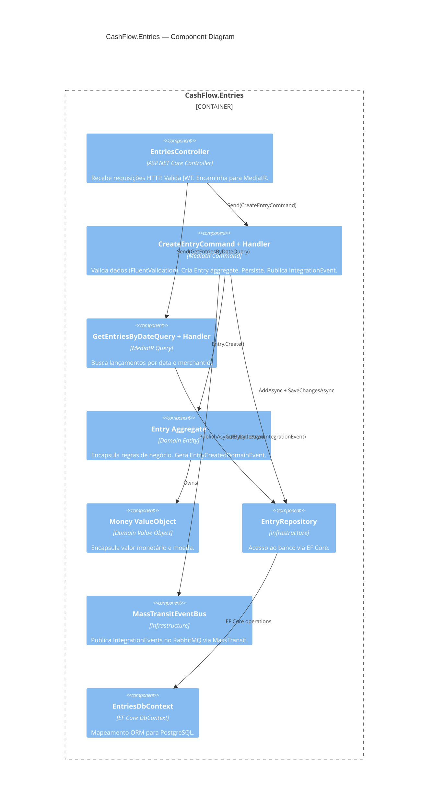
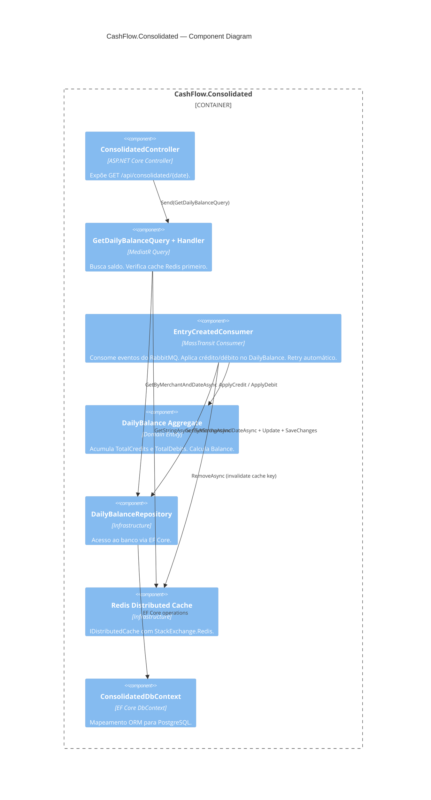
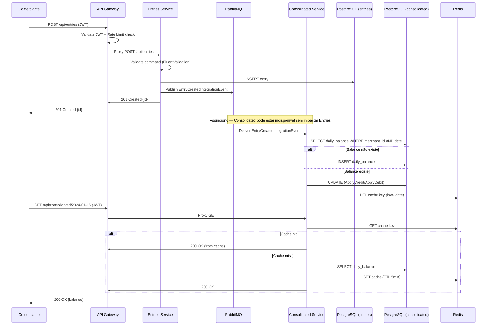

# C4 Model — Component Diagram

> Nível 3: Componentes internos do Entries Service e Consolidated Service.

## Entries Service

## Consolidated Service

## Fluxo: Criação de Lançamento e Consolidação

