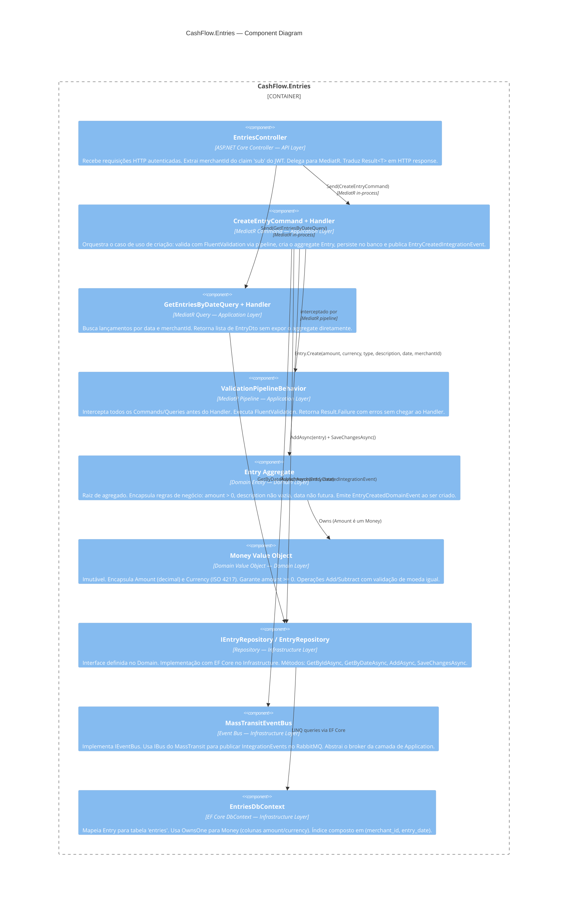
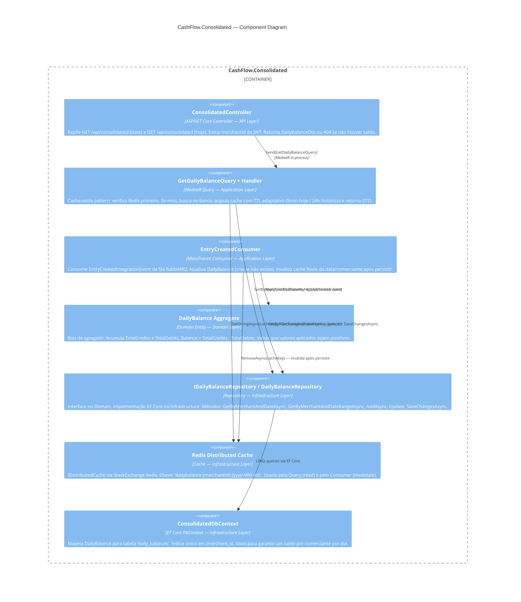
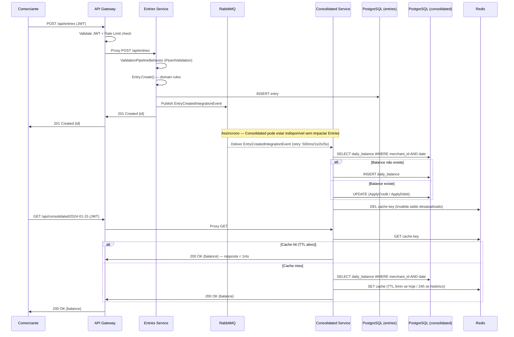

# C4 Model — Component Diagram

> **Nível 3 — Components:** Detalha os blocos internos de cada serviço, suas responsabilidades e como se comunicam. Cada serviço segue **Clean Architecture** com camadas Domain → Application → Infrastructure → API.

---

## Estrutura de Camadas (por serviço)

```
API/              ← Controllers: HTTP in/out, JWT extraction, delegação para MediatR
Application/      ← Commands, Queries, Validators, Handlers, Consumers (CQRS)
Domain/           ← Entities, Aggregates, Value Objects, Domain Events, Interfaces
Infrastructure/   ← EF Core DbContext, Repositories, EventBus (MassTransit), Cache
```

A regra de dependência flui **de fora para dentro**: API → Application → Domain. Infrastructure implementa interfaces definidas no Domain.

---

## Entries Service

> Responsabilidade: **registrar lançamentos financeiros** (débitos e créditos) de um comerciante. Persiste no banco e publica um evento de integração para que outros serviços possam reagir de forma assíncrona.



### Responsabilidades por Componente — Entries Service

| Componente | Camada | Responsabilidade principal | Dependências |
|---|---|---|---|
| `EntriesController` | API | HTTP I/O, extração de `merchantId` do JWT, mapeamento Result → HTTP | MediatR |
| `ValidationPipelineBehavior` | Application | Validação transversal antes de qualquer Handler | FluentValidation |
| `CreateEntryCommand + Handler` | Application | Caso de uso: criar lançamento, persistir, publicar evento | `IEntryRepository`, `IEventBus` |
| `GetEntriesByDateQuery + Handler` | Application | Caso de uso: listar lançamentos por data | `IEntryRepository` |
| `Entry` (Aggregate) | Domain | Regras de negócio do lançamento; gera `EntryCreatedDomainEvent` | `Money` |
| `Money` (Value Object) | Domain | Imutabilidade e validação monetária | — |
| `IEntryRepository` | Domain | Contrato de persistência (interface) | — |
| `EntryRepository` | Infrastructure | Implementação EF Core do contrato | `EntriesDbContext` |
| `MassTransitEventBus` | Infrastructure | Publicação de eventos no RabbitMQ | MassTransit `IBus` |
| `EntriesDbContext` | Infrastructure | Mapeamento ORM, configuração de índices | EF Core + Npgsql |

---

## Consolidated Service

> Responsabilidade: **consolidar o saldo diário por comerciante**. Consome eventos publicados pelo Entries Service de forma assíncrona, acumula créditos e débitos no aggregate `DailyBalance`, e serve consultas de saldo com cache Redis.



### Responsabilidades por Componente — Consolidated Service

| Componente | Camada | Responsabilidade principal | Dependências |
|---|---|---|---|
| `ConsolidatedController` | API | HTTP I/O, extração de `merchantId` do JWT, roteamento por data | MediatR |
| `GetDailyBalanceQuery + Handler` | Application | Cache-aside: Redis → DB → Redis (fill) | `IDailyBalanceRepository`, `IDistributedCache` |
| `EntryCreatedConsumer` | Application | Projeção de eventos: atualiza saldo + invalida cache | `IDailyBalanceRepository`, `IDistributedCache` |
| `DailyBalance` (Aggregate) | Domain | Acumulação de créditos/débitos; regra Balance = Credits - Debits | — |
| `IDailyBalanceRepository` | Domain | Contrato de persistência (interface) | — |
| `DailyBalanceRepository` | Infrastructure | Implementação EF Core do contrato | `ConsolidatedDbContext` |
| Redis (`IDistributedCache`) | Infrastructure | Cache de leitura (TTL 5 min/24h) e invalidação pós-evento | StackExchange.Redis |
| `ConsolidatedDbContext` | Infrastructure | Mapeamento ORM, índice único merchant+date | EF Core + Npgsql |

---

## Fluxo: Criação de Lançamento e Consolidação

> Demonstra o caminho completo de uma requisição, incluindo o desacoplamento assíncrono entre os dois serviços e o comportamento do cache Redis.



---

## Navegação

| Nível | Arquivo |
|---|---|
| Context Diagram (visão de negócio) | [context.md](context.md) |
| Container Diagram (serviços e infra) | [container.md](container.md) |
| Cloud Architecture (AWS) | [cloud.md](cloud.md) |
| Cloud Architecture (Azure) | [cloud-azure.md](cloud-azure.md) |
