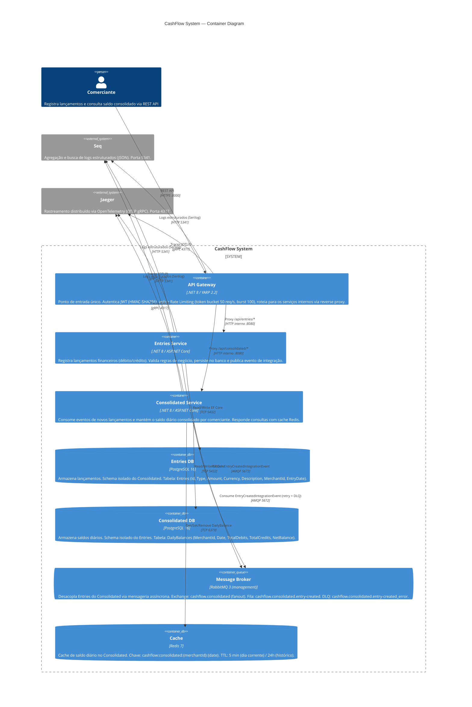

# C4 Model — Container Diagram

> Nível 2: detalha os containers (processos e datastores) que compõem o sistema CashFlow, as tecnologias escolhidas e os canais de comunicação entre eles.

Navegação: [Contexto](context.md) | **Container** | [Componentes](component.md)

---

## Visão Geral



---

## Descrição dos Containers

### Serviços de Aplicação

| Container | Tecnologia | Porta exposta | Responsabilidade principal |
|---|---|---|---|
| **API Gateway** | .NET 8, YARP 2.2 | 8000 (externo) | Autenticação JWT, rate limiting, reverse proxy para os serviços internos. Único container acessível externamente. |
| **Entries Service** | .NET 8, ASP.NET Core, MediatR, EF Core | 8080 (interno) | Registro de lançamentos (débito/crédito). Validação via FluentValidation + MediatR pipeline. Publicação de eventos. |
| **Consolidated Service** | .NET 8, ASP.NET Core, MassTransit, EF Core | 8080 (interno) | Consumo de eventos e manutenção do saldo diário consolidado. Leituras servidas com cache Redis. |

### Datastores

| Container | Tecnologia | Porta | Dados armazenados | Isolamento |
|---|---|---|---|---|
| **Entries DB** | PostgreSQL 16 | 5432 | Lançamentos financeiros | Schema e credenciais exclusivos do Entries Service |
| **Consolidated DB** | PostgreSQL 16 | 5432 | Saldos diários por comerciante | Schema e credenciais exclusivos do Consolidated Service |
| **Cache** | Redis 7 | 6379 | Saldo diário em memória (TTL adaptativo) | Exclusivo do Consolidated Service |

### Infraestrutura de Mensageria e Observabilidade

| Container | Tecnologia | Porta | Papel |
|---|---|---|---|
| **Message Broker** | RabbitMQ 3 | 5672 (AMQP), 15672 (Management UI) | Entrega garantida de eventos com retry automático (500ms → 1s → 2s → 5s) e DLQ |
| **Seq** | Seq latest | 5341 (ingest), 80 (UI) | Coleta e indexação de logs estruturados JSON emitidos pelo Serilog |
| **Jaeger** | Jaeger latest | 4317 (OTLP gRPC), 16686 (UI) | Coleta e visualização de traces distribuídos via OpenTelemetry |

---

## Fluxos de Comunicação

### Fluxo 1 — Registro de lançamento (síncrono + assíncrono)

```
Comerciante
  → [HTTPS :8000] API Gateway (valida JWT, aplica rate limit)
  → [HTTP interno] Entries Service (valida, persiste no PostgreSQL)
  → [AMQP] RabbitMQ (publica EntryCreatedIntegrationEvent)
  → [AMQP] Consolidated Service (consome evento, atualiza saldo, invalida cache Redis)
```

### Fluxo 2 — Consulta de saldo consolidado (leitura com cache)

```
Comerciante
  → [HTTPS :8000] API Gateway (valida JWT)
  → [HTTP interno] Consolidated Service
      → Redis HIT  → retorna saldo em < 1ms
      → Redis MISS → consulta PostgreSQL → armazena no Redis → retorna saldo
```

### Fluxo 3 — Observabilidade

```
Entries / Consolidated / Gateway
  → Serilog → [HTTP 5341] → Seq  (logs estruturados com CorrelationId)
  → OpenTelemetry → [gRPC 4317] → Jaeger  (traces com spans por handler/query)
```

---

## Decisões de Isolamento

| Decisão | Justificativa | ADR |
|---|---|---|
| Banco de dados separado por serviço | Evita acoplamento de schema. Cada serviço evolui e faz deploy independentemente sem coordenação de migrações. | [ADR-001](../decisions/ADR-001-microservices.md) |
| Comunicação assíncrona via RabbitMQ | Entries continua operando se Consolidated cair — requisito não-funcional explícito. Retry e DLQ garantem entrega. | [ADR-002](../decisions/ADR-002-async-messaging.md) |
| Cache Redis no Consolidated | Atende picos de 50 req/s sem pressão no banco. Invalidação ativa mantém consistência após novos lançamentos. | [ADR-005](../decisions/ADR-005-redis-cache.md) |
| API Gateway como único ponto de entrada | Centraliza autenticação JWT, rate limiting e correlação de logs. Serviços internos não ficam expostos. | [ADR-004](../decisions/ADR-004-jwt-auth.md) |
| CQRS via MediatR dentro de cada serviço | Separa leitura de escrita, facilita testes unitários de handlers e adição de cross-cutting concerns via pipeline. | [ADR-003](../decisions/ADR-003-cqrs-mediatr.md) |

---

## Mapeamento Local vs. Produção

| Container local (Docker Compose) | Equivalente AWS | Equivalente Azure |
|---|---|---|
| API Gateway (container) | ECS Fargate + ALB | Azure Container Apps + Front Door |
| Entries / Consolidated (containers) | ECS Fargate | Azure Container Apps |
| PostgreSQL (container) | Amazon RDS PostgreSQL | Azure Database for PostgreSQL Flexible Server |
| RabbitMQ (container) | Amazon MQ for RabbitMQ | Azure Service Bus (Premium) |
| Redis (container) | Amazon ElastiCache for Redis | Azure Cache for Redis |
| Seq (container) | CloudWatch Logs + Insights | Azure Monitor + Log Analytics |
| Jaeger (container) | AWS X-Ray | Azure Application Insights |

> Detalhes de implantação cloud: [cloud.md (AWS)](cloud.md) | [cloud-azure.md (Azure)](cloud-azure.md)
