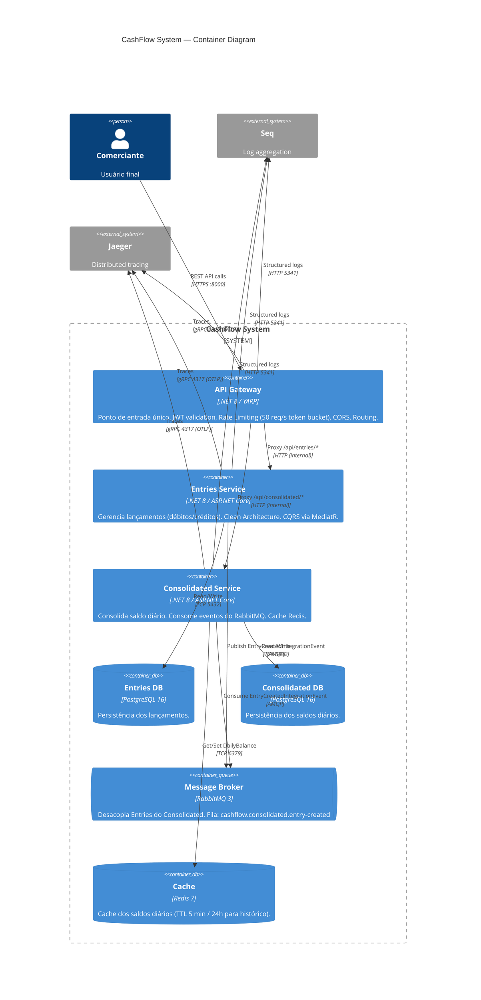

# C4 Model — Container Diagram

> Nível 2: Containers que compõem o sistema CashFlow e suas responsabilidades.

## Decisões de Isolamento

| Decisão | Justificativa |
|---|---|
| Banco de dados separado por serviço | Evita acoplamento de schema. Cada serviço evolui independentemente. |
| Comunicação assíncrona via RabbitMQ | Entries continua operando se Consolidated cair (requisito não-funcional explícito) |
| Cache Redis no Consolidated | Atende picos de 50 req/s sem bater no banco a cada requisição |
| API Gateway como único ponto de entrada | Centraliza autenticação, rate limiting e observabilidade |
