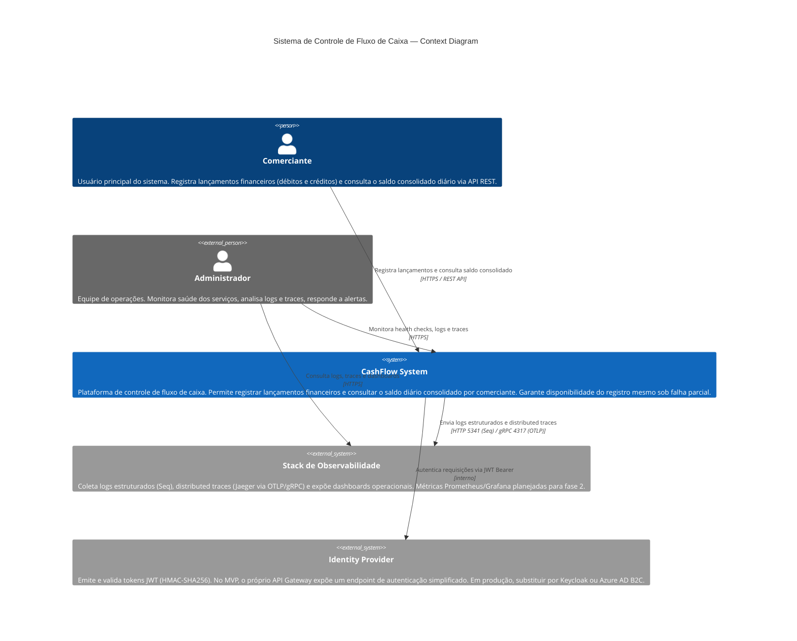

# C4 Model — Context Diagram

> **Nível 1 — Business Context:** Visão de mais alto nível do sistema. Mostra quem usa o sistema, o que o sistema faz e com quais sistemas externos ele se integra. Não detalha tecnologias internas.

---

## Problema de Negócio

Comerciantes precisam de controle financeiro diário confiável: registrar entradas e saídas (débitos/créditos) e consultar o saldo consolidado a qualquer momento. O sistema deve garantir que o registro de lançamentos continue funcionando mesmo que a consolidação esteja temporariamente indisponível.

---

## Diagrama

---

## Atores

| Ator | Tipo | Responsabilidades |
|---|---|---|
| **Comerciante** | Usuário interno | Registra débitos e créditos via API. Consulta o relatório de saldo diário consolidado. Autenticado via JWT Bearer. |
| **Administrador** | Usuário externo | Monitora a saúde operacional do sistema. Acessa Seq para análise de logs e Jaeger para rastreamento de requisições. Não interage com a API de negócio. |

---

## Sistemas Externos

| Sistema | Papel | Tecnologia (dev) | Tecnologia (prod) |
|---|---|---|---|
| **Stack de Observabilidade** | Logs estruturados JSON, distributed tracing ponta-a-ponta, dashboards operacionais. | Seq + Jaeger (containers Docker) | CloudWatch + X-Ray (AWS) / Log Analytics + Application Insights (Azure) |
| **Identity Provider** | Emissão de tokens JWT assinados (HMAC-SHA256). Valida issuer, audience e expiração. | Endpoint `/api/auth/token` no próprio Gateway (demo) | Keycloak self-hosted ou Azure AD B2C (OAuth2 + PKCE) |

---

## Requisitos Não-Funcionais Capturados neste Nível

| Requisito | Decisão |
|---|---|
| **Disponibilidade do registro** | Registro de lançamentos não depende do serviço de consolidação (assíncrono via mensageria) |
| **Isolamento de dados por comerciante** | `merchantId` extraído do JWT — nunca do body da requisição |
| **Autenticação** | JWT Bearer validado no Gateway e re-validado nos serviços internos (defense in depth) |
| **Observabilidade** | Correlation ID propagado em todas as requisições; logs e traces centralizados |
| **Escalabilidade** | Cada serviço escala horizontalmente de forma independente |

---

## Navegação

| Próximo nível | Arquivo |
|---|---|
| Container Diagram (serviços internos e infra) | [container.md](container.md) |
| Component Diagram (componentes por serviço) | [component.md](component.md) |
| Cloud Architecture (AWS) | [cloud.md](cloud.md) |
| Cloud Architecture (Azure) | [cloud-azure.md](cloud-azure.md) |
