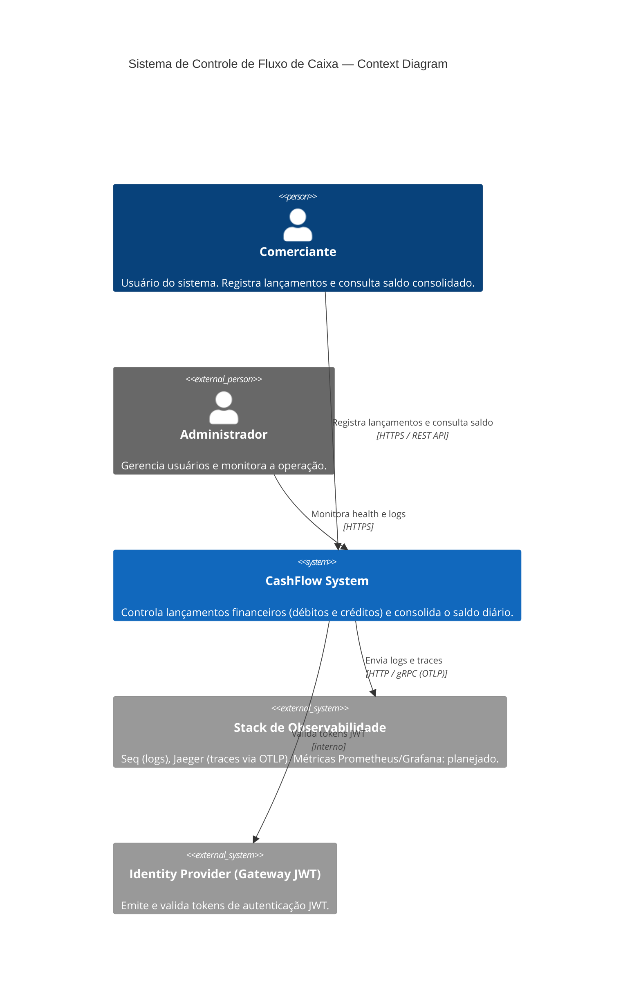

# C4 Model — Context Diagram

> Nível 1: Visão do sistema no contexto do negócio e dos atores externos.

## Atores

| Ator | Descrição |
|---|---|
| Comerciante | Usuário principal. Registra débitos/créditos e consulta relatório diário. |
| Administrador | Acesso ao painel de observabilidade (Seq, Jaeger). |

## Sistemas Externos

| Sistema | Papel |
|---|---|
| Stack de Observabilidade | Logs estruturados (Seq), distributed tracing (Jaeger via OTLP/gRPC 4317). Métricas (Prometheus/Grafana) planejadas para fase 2. |
| Identity Provider | Emissão de JWT — no MVP o próprio Gateway emite o token (demo endpoint) |
